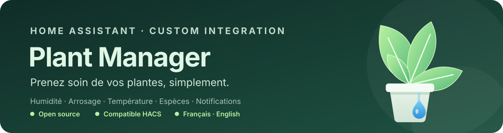

<div align="center">

**Suivez l'humidité, les besoins en arrosage et la batterie de vos plantes d'intérieur directement dans Home Assistant.**

[](https://hacs.xyz/)
[](https://github.com/elkamy/ha-plant-manager/actions/workflows/validate.yml)
[](https://github.com/elkamy/ha-plant-manager/actions/workflows/hassfest.yml)
[](https://github.com/elkamy/ha-plant-manager/actions/workflows/hacs.yml)

[Installer avec HACS](https://my.home-assistant.io/redirect/hacs_repository/?owner=elkamy&repository=ha-plant-manager&category=integration) · [Ouvrir les issues](https://github.com/elkamy/ha-plant-manager/issues) · [Consulter les versions](https://github.com/elkamy/ha-plant-manager/releases)

</div>

Plant Manager est une intégration personnalisée Home Assistant pour gérer des plantes d'intérieur à partir de capteurs d'humidité du sol et, facultativement, de capteurs de batterie. Elle crée un capteur de statut par plante et fournit une carte Lovelace dédiée.

## Fonctionnalités

- Configuration de chaque plante depuis l'interface Home Assistant.
- Sélection d'un capteur d'humidité et, facultativement, d'un capteur de batterie.
- Capteur de statut par plante.
- Alertes d'arrosage avec seuil configurable, délai et anti-répétition pendant un épisode de sol sec.
- Alertes de batterie faible avec seuil configurable et réarmement après récupération.
- Activation/désactivation des notifications indépendamment pour chaque plante.
- Carte Lovelace avec tri par nom, humidité ou statut ; filtres par état ; résumé visuel et mode compact.
- Conseils d'entretien contextuels et indication de l'ancienneté de la dernière mesure.
- Historique d'humidité sur 24 heures et tendance optionnels.
- Vérifications des valeurs invalides ou indisponibles pour éviter les alertes et affichages trompeurs.

## Installation

### Avec HACS

1. Assurez-vous que [HACS](https://hacs.xyz/) est installé.
2. Cliquez sur le bouton [**Installer avec HACS**](https://my.home-assistant.io/redirect/hacs_repository/?owner=elkamy&repository=ha-plant-manager&category=integration), ou ouvrez HACS → Intégrations → menu ⋮ → Dépôts personnalisés.
3. Ajoutez `elkamy/ha-plant-manager` avec la catégorie **Integration** si le dépôt n'est pas déjà présent.
4. Installez **Plant Manager** puis redémarrez Home Assistant.
5. Allez dans **Paramètres → Appareils et services → Ajouter une intégration**, puis recherchez **Plant Manager**.

### Installation manuelle

1. Copiez le dossier `custom_components/plant_manager` dans `config/custom_components/plant_manager`.
2. Redémarrez Home Assistant.
3. Ajoutez l'intégration depuis **Paramètres → Appareils et services**.

## Configuration des plantes et des alertes

Ajoutez chaque plante depuis le flux de configuration, puis ouvrez ses options pour régler les seuils, les services de notification et le délai.

- **Humidité basse** : l'alerte se déclenche au passage sous le seuil. Une seule notification est envoyée pendant un épisode de sol sec ; l'humidité doit revenir au seuil ou au-dessus avant qu'un nouvel épisode puisse déclencher une alerte.
- **Batterie faible** : seuil par défaut de 25 %. L'alerte se réarme lorsque la batterie remonte à 5 points au-dessus du seuil (30 % par défaut).
- **Délai** : partagé entre les alertes d'arrosage et de batterie, configurable de 0 à 1 440 minutes.
- **Notifications activées** : désactive les alertes de cette plante sans modifier les autres plantes.
- Les capteurs de batterie doivent fournir un pourcentage de 0 à 100. Les états non numériques, indisponibles et hors plage sont ignorés.

Les seuils d'humidité sont génériques : adaptez-les aux besoins de chaque plante et aux caractéristiques de son capteur.

## Carte Lovelace

Depuis la version 0.2.5, l'intégration enregistre automatiquement le JavaScript de la carte au démarrage. Après une mise à jour, redémarrez Home Assistant puis rechargez le tableau de bord. Une ancienne ressource manuelle `/local/plant-manager-card.js` peut être supprimée si elle est encore configurée.

Ajoutez une carte manuelle avec cette configuration :

```yaml
type: custom:plant-manager-card
title: Mes plantes
sort_by: status
show_images: true
show_battery: true
```

### Fiche détaillée d'une plante

Une seconde carte permet d'afficher une plante individuellement, avec son humidité, les seuils configurés, l'état de la batterie, l'ancienneté de la dernière mesure et la tendance sur 24 h.

```yaml
type: custom:plant-manager-detail-card
entity: sensor.monstera_status
show_history: true
```

Remplacez `sensor.monstera_status` par l'entité de statut créée pour votre plante. L'option `title` permet de personnaliser le titre ; `show_history: false` masque l'historique.

### Options disponibles

| Option | Valeurs | Description |
| --- | --- | --- |
| `sort_by` | `name`, `moisture`, `status` | Trie les plantes par nom, humidité croissante ou statut. Les humidités indisponibles sont placées en dernier. |
| `filter_by` | `all`, `needs_water`, `attention` | Affiche toutes les plantes, celles à arroser ou celles qui nécessitent une attention. |
| `show_images` | `true`, `false` | Affiche ou masque les photos personnalisées. |
| `show_battery` | `true`, `false` | Affiche ou masque les indicateurs de batterie. |
| `show_history` | `true`, `false` | Affiche la courbe et la tendance d'humidité sur 24 h. Désactivé par défaut. |
| `compact` | `true`, `false` | Réduit les marges et l'espacement vertical. |
| `tap_action` | `none` | Désactive l'ouverture des détails de la plante au toucher. Par défaut, le toucher ouvre « Plus d'informations ». |

Exemple compact avec historique et filtre d'attention :

```yaml
type: custom:plant-manager-card
title: Mes plantes à surveiller
sort_by: status
filter_by: attention
show_history: true
compact: true
```

La carte peut signaler une hausse d'humidité d'au moins 15 points comme **arrosage possible (estimation)**. Ce signal n'est pas une détection certaine : un changement de capteur ou une autre cause peut produire une hausse similaire.

## Développement et tests

Les tests automatisés couvrent la logique d'alerte, les capteurs et le rendu de la carte.

Exécuter les tests localement :

```bash
python -m compileall -q custom_components/plant_manager tests
python -m unittest discover -s tests -v
node --check custom_components/plant_manager/www/plant-manager-card.js
node --check custom_components/plant_manager/www/plant-manager-detail-card.js
node --test tests/test_card.js tests/test_detail_card.js
```

La CI vérifie également les métadonnées JSON, HACS et Hassfest.

Pour contribuer, consultez [CONTRIBUTING.md](CONTRIBUTING.md). Pour signaler un bug ou demander une fonctionnalité, [ouvrez une issue](https://github.com/elkamy/ha-plant-manager/issues/new/choose).

## Compatibilité

- Intégration personnalisée Home Assistant.
- Version minimale déclarée : Home Assistant 2024.6.0.
- Installation et mises à jour via HACS ou manuellement.

## Licence

Distribué sous licence MIT. Consultez le fichier [LICENSE](LICENSE).
